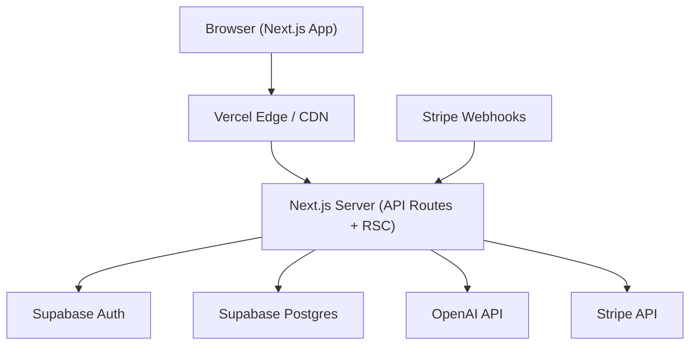
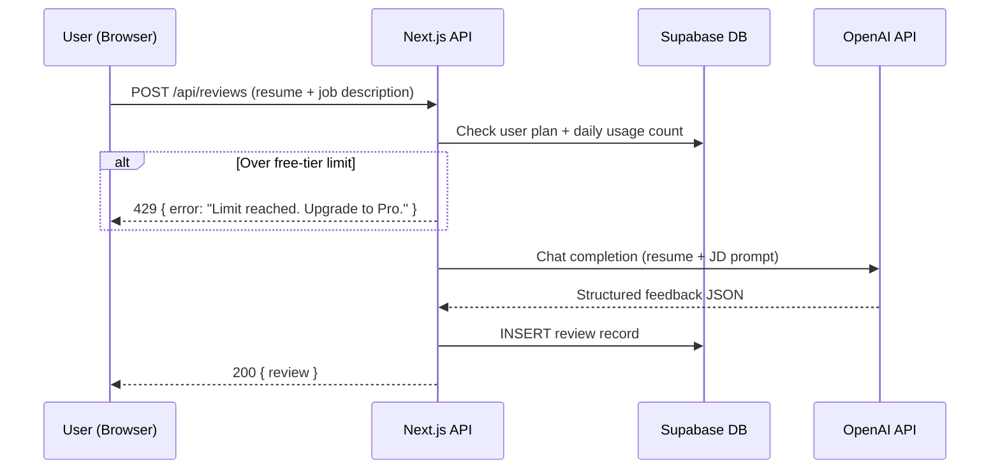
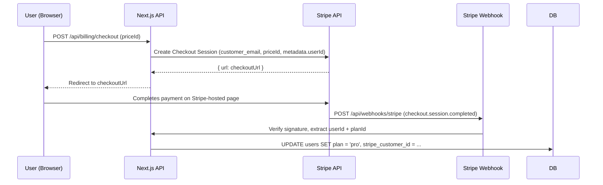

# Design Document: AI Resume Reviewer SaaS

## Overview

AI Resume Reviewer is a SaaS application that lets users upload or paste a resume alongside a target job description and receive structured, scored feedback powered by an LLM. The platform includes a marketing landing page, email/OAuth authentication, a review history dashboard, and Stripe-backed subscription tiers that gate the number of reviews and depth of feedback available to each user.

The application is built on Next.js 14 (App Router), Tailwind CSS, Supabase (Postgres + Auth), the OpenAI API for AI feedback, and Stripe for payments. It deploys to Vercel.

---

## Architecture

### System Overview



### Request Flow — Resume Review



### Request Flow — Subscription Upgrade



---

## Components and Interfaces

### 1. Landing Page (`/`)

**Purpose**: Marketing page that converts visitors to signups.

**Sections**:
- Hero: headline, sub-headline, CTA button ("Get Started Free")
- Feature highlights: 3-column grid
- How it works: 3-step visual
- Pricing table: Starter (free) / Pro ($19/mo)
- Footer

**Interface**: Static Next.js page, no API calls. CTA links to `/sign-up`.

---

### 2. Auth (`/sign-up`, `/sign-in`)

**Purpose**: Email+password signup and login via Supabase Auth.

**Interface**:
```typescript
// Supabase Auth helpers (server-side)
supabase.auth.signUp({ email, password })
supabase.auth.signInWithPassword({ email, password })
supabase.auth.signOut()
supabase.auth.getUser()   // used in middleware + RSC
```

**Session persistence**: Supabase session cookie, refreshed automatically via middleware.

---

### 3. Review Submission (`/dashboard/new`)

**Purpose**: Form where user pastes resume text and job description, then submits for AI review.

**Client component interface**:
```typescript
interface ReviewFormProps {
  userPlan: 'starter' | 'pro'
  dailyUsageCount: number
}
```

**API Route**: `POST /api/reviews`

```typescript
// Request body
interface CreateReviewRequest {
  resumeText: string       // max 8000 chars
  jobDescription: string   // max 4000 chars
}

// Response
interface CreateReviewResponse {
  id: string
  score: number            // 0–100
  summary: string
  strengths: string[]
  improvements: string[]
  keywordMatches: KeywordMatch[]
  createdAt: string
}

interface KeywordMatch {
  keyword: string
  found: boolean
  context?: string         // sentence where keyword appears
}
```

---

### 4. Review History (`/dashboard`)

**Purpose**: List of past reviews with score badges, sortable by date.

**API Route**: `GET /api/reviews`

```typescript
// Response
interface ReviewListResponse {
  reviews: ReviewSummary[]
  totalCount: number
}

interface ReviewSummary {
  id: string
  score: number
  jobTitle: string         // extracted from JD or user-provided
  createdAt: string
}
```

---

### 5. Review Detail (`/dashboard/reviews/[id]`)

**Purpose**: Full feedback view for a single review.

**API Route**: `GET /api/reviews/:id`

```typescript
interface ReviewDetailResponse extends CreateReviewResponse {
  resumeSnippet: string    // first 500 chars of resume for reference
  jobDescriptionSnippet: string
}
```

---

### 6. Billing & Account (`/dashboard/billing`)

**Purpose**: Shows current plan, usage, upgrade CTA, and cancel option.

**API Routes**:

```typescript
// POST /api/billing/checkout
interface CheckoutRequest {
  priceId: string          // Stripe price ID for Pro plan
}
interface CheckoutResponse {
  url: string              // Stripe Checkout redirect URL
}

// POST /api/billing/cancel
// No body; cancels at period end via Stripe API
interface CancelResponse {
  cancelAt: string         // ISO date of cancellation
}

// GET /api/billing/status
interface BillingStatusResponse {
  plan: 'starter' | 'pro'
  reviewsThisMonth: number
  reviewsLimit: number     // 3 for starter, unlimited (null) for pro
  stripeSubscriptionStatus?: string
  currentPeriodEnd?: string
}
```

---

### 7. Stripe Webhook (`/api/webhooks/stripe`)

**Purpose**: Receives and processes Stripe events to keep DB in sync.

**Handled events**:
- `checkout.session.completed` → upgrade user to pro
- `customer.subscription.deleted` → downgrade user to starter

---

## Data Models

### `users` table (extends Supabase auth.users)

```sql
CREATE TABLE public.users (
  id            UUID PRIMARY KEY REFERENCES auth.users(id) ON DELETE CASCADE,
  email         TEXT NOT NULL,
  plan          TEXT NOT NULL DEFAULT 'starter',   -- 'starter' | 'pro'
  stripe_customer_id    TEXT,
  stripe_subscription_id TEXT,
  subscription_status   TEXT,                      -- 'active' | 'canceled' | null
  subscription_ends_at  TIMESTAMPTZ,
  created_at    TIMESTAMPTZ NOT NULL DEFAULT now(),
  updated_at    TIMESTAMPTZ NOT NULL DEFAULT now()
);
```

### `reviews` table

```sql
CREATE TABLE public.reviews (
  id              UUID PRIMARY KEY DEFAULT gen_random_uuid(),
  user_id         UUID NOT NULL REFERENCES public.users(id) ON DELETE CASCADE,
  resume_text     TEXT NOT NULL,
  job_description TEXT NOT NULL,
  score           INTEGER NOT NULL CHECK (score >= 0 AND score <= 100),
  summary         TEXT NOT NULL,
  strengths       JSONB NOT NULL DEFAULT '[]',      -- string[]
  improvements    JSONB NOT NULL DEFAULT '[]',      -- string[]
  keyword_matches JSONB NOT NULL DEFAULT '[]',      -- KeywordMatch[]
  job_title       TEXT,
  created_at      TIMESTAMPTZ NOT NULL DEFAULT now()
);

CREATE INDEX idx_reviews_user_id ON public.reviews(user_id);
CREATE INDEX idx_reviews_created_at ON public.reviews(created_at DESC);
```

### `daily_usage` table

```sql
CREATE TABLE public.daily_usage (
  id         UUID PRIMARY KEY DEFAULT gen_random_uuid(),
  user_id    UUID NOT NULL REFERENCES public.users(id) ON DELETE CASCADE,
  date       DATE NOT NULL DEFAULT CURRENT_DATE,
  count      INTEGER NOT NULL DEFAULT 0,
  UNIQUE(user_id, date)
);
```

### TypeScript types (generated / shared)

```typescript
export type Plan = 'starter' | 'pro'

export interface User {
  id: string
  email: string
  plan: Plan
  stripeCustomerId: string | null
  stripeSubscriptionId: string | null
  subscriptionStatus: string | null
  subscriptionEndsAt: string | null
}

export interface Review {
  id: string
  userId: string
  resumeText: string
  jobDescription: string
  score: number
  summary: string
  strengths: string[]
  improvements: string[]
  keywordMatches: KeywordMatch[]
  jobTitle: string | null
  createdAt: string
}

export interface KeywordMatch {
  keyword: string
  found: boolean
  context?: string
}

export interface DailyUsage {
  userId: string
  date: string
  count: number
}
```

---

## Key Functions with Formal Specifications

### `checkRateLimit(userId, plan)`

```typescript
async function checkRateLimit(
  userId: string,
  plan: Plan
): Promise<{ allowed: boolean; remaining: number }>
```

**Preconditions**:
- `userId` is a valid UUID referencing an existing user
- `plan` is `'starter'` or `'pro'`

**Postconditions**:
- If `plan === 'pro'`: returns `{ allowed: true, remaining: Infinity }`
- If `plan === 'starter'` and today's usage count < `STARTER_DAILY_LIMIT` (3): returns `{ allowed: true, remaining: STARTER_DAILY_LIMIT - count }`
- If `plan === 'starter'` and today's usage count >= `STARTER_DAILY_LIMIT`: returns `{ allowed: false, remaining: 0 }`
- Upserts `daily_usage` row for `(userId, today)` atomically (no double-count on concurrent calls)

**Loop Invariants**: N/A (single DB upsert, no loop)

---

### `generateReview(resumeText, jobDescription)`

```typescript
async function generateReview(
  resumeText: string,
  jobDescription: string
): Promise<AIReviewResult>

interface AIReviewResult {
  score: number
  summary: string
  strengths: string[]
  improvements: string[]
  keywordMatches: KeywordMatch[]
  jobTitle: string
}
```

**Preconditions**:
- `resumeText.length` > 0 and <= 8000 characters
- `jobDescription.length` > 0 and <= 4000 characters
- OpenAI API key is set in environment

**Postconditions**:
- Returns a valid `AIReviewResult` with `score` in [0, 100]
- `strengths` and `improvements` arrays each have at least 1 item
- `keywordMatches` reflects keywords extracted from `jobDescription`
- Throws `AIServiceError` if OpenAI returns non-200 or malformed JSON

---

### `handleStripeWebhook(req)`

```typescript
async function handleStripeWebhook(
  req: NextRequest
): Promise<NextResponse>
```

**Preconditions**:
- Request contains `stripe-signature` header
- `STRIPE_WEBHOOK_SECRET` is set in environment
- Request body is the raw Stripe event payload (not parsed)

**Postconditions**:
- For `checkout.session.completed`: user's `plan` is set to `'pro'`, `stripe_customer_id` and `stripe_subscription_id` are stored
- For `customer.subscription.deleted`: user's `plan` is set to `'starter'`, `subscription_status` is set to `'canceled'`
- Unrecognized event types are silently ignored (return 200)
- Returns 400 if signature verification fails
- DB update is idempotent (re-processing the same event produces the same state)

---

## Algorithmic Pseudocode

### Main Review Creation Algorithm

```pascal
ALGORITHM createReview(userId, resumeText, jobDescription)
INPUT: userId (UUID), resumeText (string), jobDescription (string)
OUTPUT: Review record or error

BEGIN
  // 1. Validate inputs
  IF resumeText = '' OR LENGTH(resumeText) > 8000 THEN
    RETURN Error("Resume must be 1–8000 characters")
  END IF
  IF jobDescription = '' OR LENGTH(jobDescription) > 4000 THEN
    RETURN Error("Job description must be 1–4000 characters")
  END IF

  // 2. Load user and check plan
  user ← DB.users.findById(userId)
  IF user = NULL THEN
    RETURN Error("User not found")
  END IF

  // 3. Rate limit check
  rateCheck ← checkRateLimit(userId, user.plan)
  IF NOT rateCheck.allowed THEN
    RETURN Error("Daily limit reached. Upgrade to Pro.")
  END IF

  // 4. Call AI service
  aiResult ← generateReview(resumeText, jobDescription)
  IF aiResult IS Error THEN
    RETURN Error("AI service unavailable. Please try again.")
  END IF

  // 5. Persist review
  review ← DB.reviews.insert({
    userId,
    resumeText,
    jobDescription,
    score:          aiResult.score,
    summary:        aiResult.summary,
    strengths:      aiResult.strengths,
    improvements:   aiResult.improvements,
    keywordMatches: aiResult.keywordMatches,
    jobTitle:       aiResult.jobTitle
  })

  // 6. Increment daily usage counter (upsert)
  DB.daily_usage.upsert(
    { userId, date: TODAY },
    { count: count + 1 }
  )

  RETURN review
END
```

**Preconditions**:
- User is authenticated (userId is valid)
- Inputs have been sanitized (no HTML injection)

**Postconditions**:
- Review is stored in DB with a generated UUID
- Daily usage counter is incremented by exactly 1
- If any step after rate-limit check fails, no partial state is written (usage is NOT incremented on AI failure)

**Loop Invariants**: N/A

---

### OpenAI Prompt Construction Algorithm

```pascal
ALGORITHM buildReviewPrompt(resumeText, jobDescription)
INPUT: resumeText (string), jobDescription (string)
OUTPUT: OpenAI messages array

BEGIN
  systemPrompt ← "You are an expert career coach and ATS specialist.
    Analyze the resume against the job description.
    Respond ONLY with valid JSON matching the schema provided."

  userPrompt ← CONCAT(
    "## Job Description\n", jobDescription,
    "\n\n## Resume\n", resumeText,
    "\n\n## Response Schema\n",
    "{
      score: number (0-100),
      summary: string (2-3 sentences),
      jobTitle: string (inferred from JD),
      strengths: string[] (3-5 items),
      improvements: string[] (3-5 items),
      keywordMatches: [{ keyword: string, found: boolean, context?: string }]
    }"
  )

  RETURN [
    { role: 'system', content: systemPrompt },
    { role: 'user',   content: userPrompt }
  ]
END
```

---

### Stripe Webhook Processing Algorithm

```pascal
ALGORITHM processStripeWebhook(rawBody, signature)
INPUT: rawBody (Buffer), signature (string)
OUTPUT: void or error

BEGIN
  // 1. Verify signature
  event ← Stripe.constructEvent(rawBody, signature, WEBHOOK_SECRET)
  IF event IS Error THEN
    RETURN HTTP 400 "Invalid signature"
  END IF

  // 2. Route by event type
  CASE event.type OF

    'checkout.session.completed':
      session  ← event.data.object
      userId   ← session.metadata.userId
      customerId    ← session.customer
      subscriptionId ← session.subscription

      DB.users.update(userId, {
        plan: 'pro',
        stripe_customer_id: customerId,
        stripe_subscription_id: subscriptionId,
        subscription_status: 'active'
      })

    'customer.subscription.deleted':
      subscription ← event.data.object
      user ← DB.users.findByStripeCustomerId(subscription.customer)
      IF user EXISTS THEN
        DB.users.update(user.id, {
          plan: 'starter',
          subscription_status: 'canceled',
          stripe_subscription_id: NULL
        })
      END IF

    OTHERWISE:
      // Ignore unknown events

  END CASE

  RETURN HTTP 200 "OK"
END
```

---

## Example Usage

### Creating a Review (API Route)

```typescript
// app/api/reviews/route.ts
export async function POST(req: NextRequest) {
  const supabase = createServerClient()
  const { data: { user } } = await supabase.auth.getUser()
  if (!user) return NextResponse.json({ error: 'Unauthorized' }, { status: 401 })

  const { resumeText, jobDescription } = await req.json()

  const review = await createReview(user.id, resumeText, jobDescription)
  if (review instanceof Error) {
    const status = review.message.includes('limit') ? 429 : 400
    return NextResponse.json({ error: review.message }, { status })
  }

  return NextResponse.json(review, { status: 201 })
}
```

### Checking Plan Gate (Server Component)

```typescript
// app/dashboard/new/page.tsx
export default async function NewReviewPage() {
  const supabase = createServerClient()
  const { data: { user } } = await supabase.auth.getUser()

  const { data: userRecord } = await supabase
    .from('users')
    .select('plan')
    .eq('id', user!.id)
    .single()

  const { data: usage } = await supabase
    .from('daily_usage')
    .select('count')
    .eq('user_id', user!.id)
    .eq('date', new Date().toISOString().split('T')[0])
    .single()

  return (
    <ReviewForm
      userPlan={userRecord?.plan ?? 'starter'}
      dailyUsageCount={usage?.count ?? 0}
    />
  )
}
```

### Stripe Checkout Session Creation

```typescript
// app/api/billing/checkout/route.ts
export async function POST(req: NextRequest) {
  const { priceId } = await req.json()
  const user = await getAuthUser(req)

  const session = await stripe.checkout.sessions.create({
    mode: 'subscription',
    payment_method_types: ['card'],
    customer_email: user.email,
    line_items: [{ price: priceId, quantity: 1 }],
    metadata: { userId: user.id },
    success_url: `${process.env.NEXT_PUBLIC_URL}/dashboard/billing?success=true`,
    cancel_url:  `${process.env.NEXT_PUBLIC_URL}/dashboard/billing?canceled=true`,
  })

  return NextResponse.json({ url: session.url })
}
```

---

## Correctness Properties

*A property is a characteristic or behavior that should hold true across all valid executions of a system — essentially, a formal statement about what the system should do. Properties serve as the bridge between human-readable specifications and machine-verifiable correctness guarantees.*

### Property 1: Starter users cannot exceed daily limit

*For any* user whose plan is `starter`, once their daily usage count reaches or exceeds `STARTER_DAILY_LIMIT` (3), `checkRateLimit` SHALL return `{ allowed: false, remaining: 0 }`.

**Validates: Requirements 3.5**

---

### Property 2: Pro users are never rate-limited

*For any* user whose plan is `pro`, `checkRateLimit` SHALL always return `{ allowed: true }` regardless of their daily usage count.

**Validates: Requirements 3.6**

---

### Property 3: AI review result is structurally valid

*For any* valid resume text (1–8000 chars) and job description (1–4000 chars), the AI_Service SHALL return a result where `score` is in [0, 100], `strengths` is a non-empty array, `improvements` is a non-empty array, and every entry in `keywordMatches` references a keyword derived from the job description.

**Validates: Requirements 3.4**

---

### Property 4: Webhook processing is idempotent

*For any* Stripe webhook event, processing it N times SHALL produce the same DB state as processing it exactly once.

**Validates: Requirements 6.6**

---

### Property 5: Reviews are user-scoped

*For any* authenticated user, `GET /api/reviews/:id` SHALL return HTTP 404 when the review's `userId` does not match the authenticated user's ID.

**Validates: Requirements 4.4, 8.3**

---

### Property 6: Usage counter only increments on successful AI response

*For any* review creation attempt where the AI_Service call fails or returns a malformed response, the requesting user's `daily_usage` count SHALL remain unchanged.

**Validates: Requirements 3.7**

---

### Property 7: Input sanitization removes HTML before AI processing

*For any* resume text or job description containing HTML markup, the text passed to the AI_Service SHALL contain no HTML tags.

**Validates: Requirements 3.9**

---

### Property 8: Unauthenticated API requests are always rejected

*For any* request to any `/api/*` route that does not carry a valid authenticated session, the System SHALL respond with HTTP 401.

**Validates: Requirements 2.6**

---

### Property 9: Review list is always user-scoped and date-ordered

*For any* authenticated user, `GET /api/reviews` SHALL return only reviews where `userId` equals the authenticated user's ID, sorted by `createdAt` descending.

**Validates: Requirements 4.1, 8.3**

---

## Error Handling

### Auth Errors

| Scenario | Response |
|---|---|
| Unauthenticated request to any `/api/*` route | 401 `{ error: "Unauthorized" }` |
| Invalid/expired session | Redirect to `/sign-in` via middleware |
| Duplicate email signup | 400 `{ error: "Email already in use" }` |

### Review Errors

| Scenario | Response |
|---|---|
| Input validation failure | 400 `{ error: "..." }` |
| Free tier daily limit exceeded | 429 `{ error: "Daily limit reached. Upgrade to Pro.", upgradeUrl: "/dashboard/billing" }` |
| OpenAI API failure / timeout | 502 `{ error: "AI service unavailable. Please try again." }` |
| Malformed AI response (non-JSON) | Retry once; if still failing, 502 |

### Billing Errors

| Scenario | Response |
|---|---|
| Stripe API unreachable | 503 `{ error: "Payment service unavailable." }` |
| Webhook signature mismatch | 400 `{ error: "Invalid webhook signature" }` |
| User not found during webhook | Log warning, return 200 (avoid Stripe retries) |

---

## Testing Strategy

### Unit Tests

**Tool**: Vitest

Key units to test:
- `checkRateLimit`: free tier limit boundary (count = 2, 3, 4), pro always allowed
- `buildReviewPrompt`: output contains both resume and JD text
- `processStripeWebhook`: correct DB mutations per event type, signature failure path
- Input validation in `createReview`: empty strings, oversized inputs

### Property-Based Tests

**Library**: fast-check

```typescript
// Score is always in [0, 100]
fc.assert(fc.asyncProperty(
  fc.string({ minLength: 1, maxLength: 8000 }),
  fc.string({ minLength: 1, maxLength: 4000 }),
  async (resume, jd) => {
    const result = await generateReview(resume, jd)
    return result.score >= 0 && result.score <= 100
  }
))

// Rate limit: starter never allowed after 3 reviews in a day
fc.assert(fc.asyncProperty(
  fc.uuid(),
  async (userId) => {
    // Simulate 3 reviews
    for (let i = 0; i < 3; i++) await checkRateLimit(userId, 'starter')
    const result = await checkRateLimit(userId, 'starter')
    return result.allowed === false
  }
))
```

### Integration Tests

- End-to-end auth flow: sign up → session cookie set → protected route accessible
- Review creation: POST `/api/reviews` → DB record created → GET `/api/reviews` returns it
- Stripe webhook: simulate `checkout.session.completed` → user plan updated to `'pro'`
- Plan gate: starter user at limit → 429 response; same user after upgrade → 200

---

## Performance Considerations

- **OpenAI latency**: Average 3–8s. Show a streaming progress indicator or optimistic UI on the review form. Consider SSE (Server-Sent Events) for streaming the AI response incrementally.
- **Database queries**: Index `reviews.user_id` and `daily_usage.(user_id, date)` (covered by UNIQUE constraint). All review list queries paginate at 20 items.
- **Rate limiting**: Daily usage check is a single indexed upsert — sub-millisecond under normal load.
- **Cold starts**: Vercel serverless functions have cold starts. Keep middleware lean; avoid loading heavy SDKs in middleware.

---

## Security Considerations

- **Row-Level Security (RLS)**: Enable RLS on `reviews` and `daily_usage` tables. Policy: `user_id = auth.uid()`.
- **Webhook verification**: Always call `stripe.constructEvent()` with raw body and secret before trusting webhook data.
- **Input sanitization**: Strip HTML from `resumeText` and `jobDescription` before sending to OpenAI (prevent prompt injection).
- **Environment secrets**: `OPENAI_API_KEY`, `STRIPE_SECRET_KEY`, `STRIPE_WEBHOOK_SECRET`, `SUPABASE_SERVICE_ROLE_KEY` — never exposed client-side.
- **CORS**: Next.js API routes are same-origin only by default; no additional CORS config needed.
- **Plan spoofing**: Plan tier is always read server-side from DB, never from client-provided headers or cookies.

---

## Project Structure

```
saas-prototype/
├── app/
│   ├── (marketing)/
│   │   ├── page.tsx                  # Landing page
│   │   └── layout.tsx
│   ├── (auth)/
│   │   ├── sign-up/page.tsx
│   │   └── sign-in/page.tsx
│   ├── dashboard/
│   │   ├── layout.tsx                # Auth guard + sidebar
│   │   ├── page.tsx                  # Review history list
│   │   ├── new/page.tsx              # New review form
│   │   ├── reviews/[id]/page.tsx     # Review detail
│   │   └── billing/page.tsx          # Billing & account
│   └── api/
│       ├── reviews/
│       │   ├── route.ts              # GET (list) + POST (create)
│       │   └── [id]/route.ts         # GET (detail)
│       ├── billing/
│       │   ├── checkout/route.ts
│       │   ├── cancel/route.ts
│       │   └── status/route.ts
│       └── webhooks/
│           └── stripe/route.ts
├── components/
│   ├── landing/
│   │   ├── Hero.tsx
│   │   ├── Features.tsx
│   │   ├── HowItWorks.tsx
│   │   └── Pricing.tsx
│   ├── dashboard/
│   │   ├── ReviewForm.tsx
│   │   ├── ReviewCard.tsx
│   │   ├── ReviewDetail.tsx
│   │   └── UsageMeter.tsx
│   └── ui/                           # Shadcn/ui primitives
├── lib/
│   ├── supabase/
│   │   ├── client.ts                 # Browser client
│   │   └── server.ts                 # Server client (cookies)
│   ├── openai.ts                     # generateReview()
│   ├── stripe.ts                     # Stripe client + helpers
│   ├── rate-limit.ts                 # checkRateLimit()
│   └── constants.ts                  # STARTER_DAILY_LIMIT = 3
├── types/
│   └── index.ts                      # Shared TypeScript types
├── middleware.ts                      # Auth session refresh
├── supabase/
│   └── migrations/
│       └── 001_initial_schema.sql
└── .env.local.example
```

---

## Dependencies

| Package | Version | Purpose |
|---|---|---|
| `next` | 14.x | Framework |
| `react` | 18.x | UI |
| `tailwindcss` | 3.x | Styling |
| `@supabase/ssr` | latest | Supabase server-side helpers |
| `@supabase/supabase-js` | latest | Supabase client |
| `openai` | 4.x | OpenAI API client |
| `stripe` | 15.x | Stripe API client |
| `@stripe/stripe-js` | 4.x | Stripe.js (client redirect) |
| `shadcn/ui` | latest | UI component primitives |
| `zod` | 3.x | Request body validation |
| `vitest` | 1.x | Unit/integration testing |
| `fast-check` | 3.x | Property-based testing |

### Environment Variables Required

```bash
# Supabase
NEXT_PUBLIC_SUPABASE_URL=
NEXT_PUBLIC_SUPABASE_ANON_KEY=
SUPABASE_SERVICE_ROLE_KEY=

# OpenAI
OPENAI_API_KEY=

# Stripe
STRIPE_SECRET_KEY=
STRIPE_WEBHOOK_SECRET=
NEXT_PUBLIC_STRIPE_PUBLISHABLE_KEY=
NEXT_PUBLIC_STRIPE_PRO_PRICE_ID=

# App
NEXT_PUBLIC_URL=https://your-app.vercel.app
```
